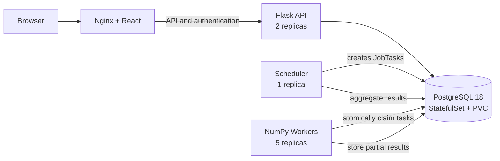

# Monte Carlo Computing Platform

A distributed platform for running reproducible Monte Carlo simulations across multiple Kubernetes workers. The current simulation estimates π and reports accuracy, uncertainty, and performance metrics through an authenticated web dashboard.

## Technology stack

| Layer | Technologies |
|---|---|
| Frontend | React, TypeScript, Vite, Tailwind CSS, shadcn/ui |
| API | Flask, Gunicorn, Flask-SQLAlchemy, Authlib |
| Compute | Python, NumPy, `SeedSequence` |
| Database | PostgreSQL 18 |
| Containers | Docker, Nginx |
| Orchestration | Kubernetes 1.36, KIND |
| Authentication | Google OpenID Connect |

## Key features

- Reproducible random streams derived from the job seed and global batch index
- Bounded-memory NumPy computation using batches of 10,000 points
- Atomic task claiming with PostgreSQL `FOR UPDATE SKIP LOCKED`
- Horizontal processing across five independent worker pods
- Asynchronous scheduling and aggregation of partial results
- Persistent PostgreSQL storage through a StatefulSet and PVC
- Dashboard for job creation, history, status, and detailed statistics

## Architecture



## How computation works

1. A user submits a seed and the total number of points.
2. The scheduler divides the job into batches and stores task ranges in PostgreSQL.
3. Worker pods atomically claim pending tasks, preventing duplicate processing.
4. Each batch receives a deterministic random stream:

   ```python
   np.random.SeedSequence([job_seed, batch_index])
   ```

5. The scheduler aggregates all partial counts and calculates the final result.

The result is reproducible regardless of worker assignment or execution order.

## Reported statistics

| Category | Metrics |
|---|---|
| Estimate | Estimated π, points inside/outside the circle |
| Accuracy | Absolute and relative error |
| Uncertainty | Standard error and approximate 95% confidence interval |
| Performance | Wall-clock runtime and points processed per second |
| Traceability | Seed, timestamps, task status, and worker pod ID |

## Example result

Local execution using five worker pods:

| Metric | Value |
|---|---:|
| Points | 1,000,000,000 |
| Seed | 50 |
| Estimated π | 3.1415634720 |
| Absolute error | 2.918159 × 10⁻⁵ |
| 95% confidence interval | [3.14146169, 3.14166526] |
| Runtime | 5.04 s |
| Throughput | 198,605,117 points/s |

> This is a single local benchmark; results vary with CPU resources, Docker configuration, and worker count.

## Project structure

```text
backend/       Flask API, scheduler, workers, and database models
frontend/      React dashboard served by Nginx
k8s/           Kubernetes workloads, Services, and persistent storage
kind-config.yaml
```

## Running the project

The complete local deployment guide is available in [docs/DEPLOYMENT.md](docs/DEPLOYMENT.md).

## Next improvements

- Alembic database migrations
- Recovery and retry for interrupted tasks
- Job cancellation and live task-level progress
- Automated unit, integration, and end-to-end tests
- Gateway API or a managed cloud load balancer
